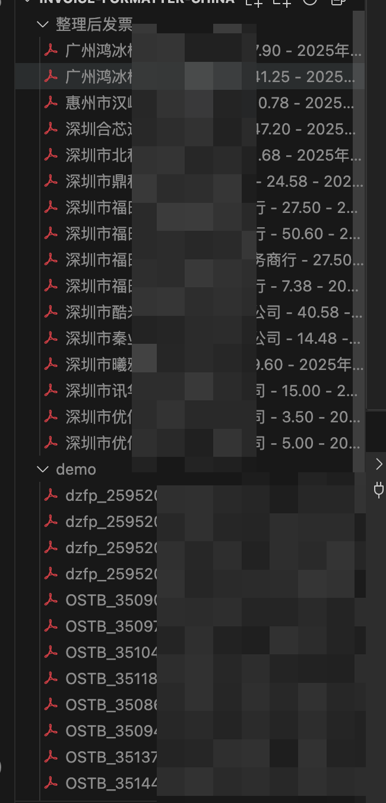
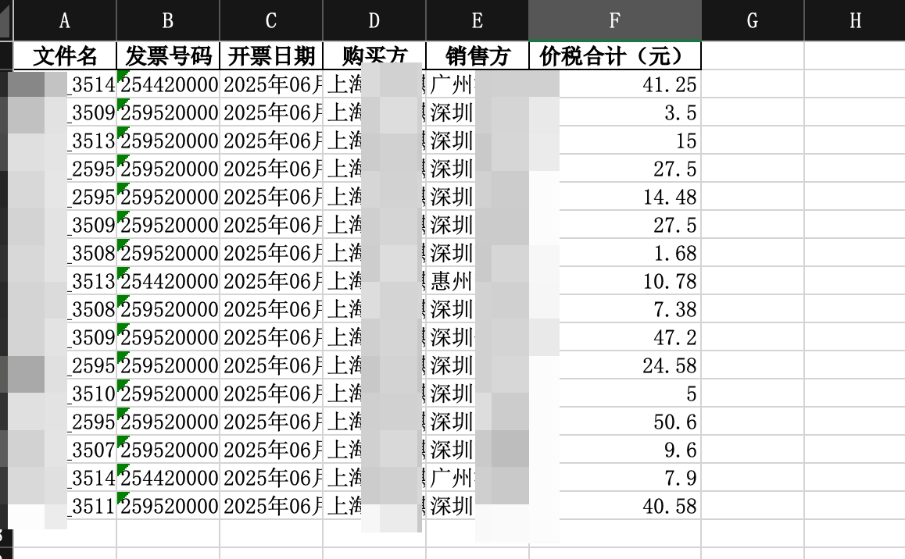

# invoice formatter china

发票pdf整理为excel表格，方便整理总价格和报销。

放入全部的原始发票，然后会提取文字，可以选择用api或者网页端处理，处理之后文件保存为excel并且支持重命名。

便于统计总金额以及整理。

python invoice_formatter_china.py  --pdf_dir ./demo  --json_out invoice_texts.json --csv_out invoices.csv --api_key sk-xxx...xxx --rename 1 --excel 1 --web 1

### ✅ 用法示例

python invoice_formatter_china.py
  --pdf_dir ./invoices \                     # 原始发票 PDF 所在文件夹（必填）
  --json_out invoice_texts.json \            # 提取的 JSON 文件名（默认 invoice_texts.json）
  --csv_out invoices.csv \                   # GPT 输出的 CSV 文件名（默认 invoices.csv）
  --api_key sk-xxx...xxx \                   # OpenAI API 密钥（web 模式下可省略）
  --rename 1 \                                # 是否重命名并复制发票（0 否 / 1 是，默认 0）
  --excel 1 \                                 # 是否输出 Excel 文件（0 否 / 1 是，默认 0）
  --web 0                                     # 是否使用 ChatGPT 网页版（0 否 / 1 是，默认 0）

---

python invoice_formatter_china.py
  --pdf_dir ./demo \                     # 原始发票 PDF 所在文件夹（必填）
  --json_out invoice_texts.json \            # 提取的 JSON 文件名（默认 invoice_texts.json）
  --csv_out invoices.csv \                   # GPT 输出的 CSV 文件名（默认 invoices.csv）
  --api_key sk-xxx...xxx \                   # OpenAI API 密钥（web 模式下可省略）
  --rename 1 \                                # 是否重命名并复制发票（0 否 / 1 是，默认 0）
  --excel 1 \                                 # 是否输出 Excel 文件（0 否 / 1 是，默认 0）
  --web 1                                     # 是否使用 ChatGPT 网页版（0 否 / 1 是，默认 0）
